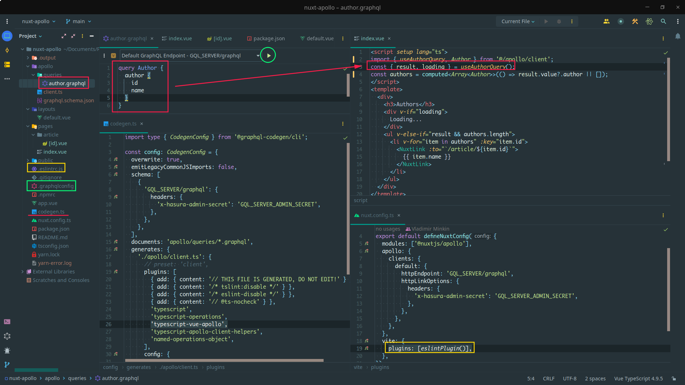

# Nuxt 3 Apollo GraphQL (Hasura)



## Setup

```bash
yarn install
```
Setup GraphQL params in .env:
```
GQL_SERVER=
GQL_SERVER_ADMIN_SECRET=
```
```bash
yarn codegen
```
```bash
yarn dev
```

## Production

Build the application for production:

```bash
yarn build
```